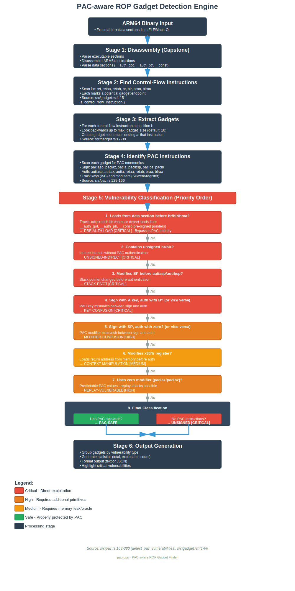

<div align="center">

</div>

# pacrops

**PAC-aware ROP Gadget Finder for ARM64 Binaries**

pacrops is a specialized tool for finding exploitable ROP gadgets in ARM64 binaries that use Pointer Authentication Codes (PAC). It identifies gadgets that are either unprotected by PAC or vulnerable to known PAC bypass techniques.

## Features

- ✅ **PAC-Aware Analysis**: Detects and classifies PAC instructions (PACIASP, RETAA, etc.)
- ✅ **Vulnerability Detection**: Identifies multiple PAC vulnerability classes
- ✅ **JSON Output**: Machine-readable output for tool integration
- ✅ **Python Bindings**: Easy integration with pwntools and exploit scripts
- ✅ **Fast & Accurate**: Built with Rust and Capstone for reliable disassembly

## Vulnerability Classes Detected

| Class | Description | Exploitability | Severity |
|-------|-------------|----------------|----------|
| **Unsigned** | No PAC protection at all | Direct | 🔴 Critical |
| **Unsigned Indirect** | `br`/`blr` without PAC | Direct | 🔴 Critical |
| **Key Confusion** | Sign with key A, auth with key B | Direct | 🔴 Critical |
| **Modifier Confusion** | Different modifiers for sign/auth | Requires additional primitives | 🟡 High |
| **Replay Vulnerable** | Uses zero modifier like `paciaz` (predictable PAC) | Requires additional primitives | 🟡 High |
| **Context Manipulation** | Loads LR/x30 from memory before `retaa`/`retab` | Requires memory leak or oracle | 🟡 Medium |
| **Stack Pivot** | SP modified before authentication | Direct | 🔴 Critical |
| **PAC-Safe** | Properly protected by PAC | Very difficult | 🟢 Safe |

### Understanding Exploitability

- **Direct**: Can be exploited with just a memory corruption primitive (buffer overflow, use-after-free, etc.)
- **Requires additional primitives**: Needs memory leaks, PAC oracle, or other info leak vulnerabilities
- **Very difficult**: Would require breaking PAC itself or finding implementation flaws

**Note**: Context Manipulation gadgets are classified conservatively. While they load the return address from the stack before authentication, an attacker would still need:
1. A valid PAC for the target address (via memory leak), or
2. A PAC oracle to brute force valid pointers, or
3. Another vulnerability to bypass PAC entirely

## Installation

### Prerequisites

- Rust toolchain (1.70+)
- Python 3.7+ (for Python bindings)
- pwntools (optional, for exploit integration)

### Building from Source

```bash
git clone https://github.com/yourusername/pacrops
cd pacrops
cargo build --release
```

The binary will be available at `./target/release/pacrops`.

## Usage

### Command Line

```bash
# Basic usage - show unsigned gadgets (default behavior)
# By default, only shows gadgets with no PAC protection (UNSIGNED + UNSIGNED-BR)
./target/release/pacrops ./binary

# Explicitly show only unsigned gadgets (same as default)
./target/release/pacrops ./binary --unsigned-only

# Show only context manipulation gadgets (modifies LR before auth)
./target/release/pacrops ./binary --context-vuln

# Show only replay vulnerable gadgets (zero modifier)
./target/release/pacrops ./binary --no-context

# Show only signed/authenticated gadgets (PAC-protected)
./target/release/pacrops ./binary --signed-only

# Show all vulnerable gadgets
./target/release/pacrops ./binary --vulnerable-only

# Show all gadgets including PAC-safe ones
./target/release/pacrops ./binary --show-all

# Search for specific instruction patterns (regex)
./target/release/pacrops ./binary --search "ldr x0"
./target/release/pacrops ./binary --search "bl.*ret"

# Combine search with filters
./target/release/pacrops ./binary --search "ldr.*ret" --unsigned-only

# Limit gadget size
./target/release/pacrops ./binary --max-size 5

# Output in JSON format (for tool integration)
./target/release/pacrops ./binary --json
```

### Example Output

```
Total PAC instructions found in binary: 4

PAC instruction locations:
  0x100000568: paciasp (PacIASP)
  0x100000594: retaa (RetAA)

0x10000054c: ldr x0, [sp], #8; ret                                        [UNSIGNED]
0x100000558: hint #0x22; bl #0x100000668; ret                             [UNSIGNED]

╔═══════════════════════════════════════════════════════════════════╗
║           PAC-Aware ROP Gadget Analysis Summary                   ║
╚═══════════════════════════════════════════════════════════════════╝

Binary:           ./demo
Max gadget size:  10
PAC instructions: 4

Total ROP gadgets: 70
Exploitable:       50 / 70 (71%)

Vulnerability Breakdown:
  ├─ Unsigned (no PAC):        22
  ├─ Unsigned indirect (br/blr): 28
  ├─ Key confusion:             0
  ├─ Modifier confusion:        0
  ├─ Replay vulnerable:         0
  ├─ Context manipulation:      0
  ├─ Stack pivot:               0
  └─ PAC-safe:                  20

⚠️  Exploitable gadgets: 50
```

## Python Bindings

pacrops includes Python bindings for easy integration with exploit development workflows.

### Quick Start

```python
from pacrops import pacrops, GadgetType

# Analyze a binary
p = pacrops('./target/binary')

# Get statistics
print(f"Found {p.pac_count} PAC instructions")
print(f"Found {len(p.exploitable_gadgets())} exploitable gadgets")

# Find specific gadgets
unsigned = p.find(gadget_type=GadgetType.UNSIGNED)
pop_gadgets = p.search(r'ldr x0.*ret')

# Iterate through gadgets
for gadget in unsigned[:5]:
    print(f"{hex(gadget.address)}: {' ; '.join(gadget.instructions)}")
```

### Integration with Pwntools

```python
#!/usr/bin/env python3
from pwn import *
from pacrops import pacrops

context.arch = 'aarch64'

# Find gadgets
p = pacrops('./binary')
pop_x0 = p.pop_register('x0')[0]
system = p.call_gadgets()[0]

log.success(f"pop x0 @ {hex(pop_x0.address)}")
log.success(f"system @ {hex(system.address)}")

# Build ROP chain
rop = b'A' * 128
rop += p64(pop_x0.address)
rop += p64(binsh_addr)
rop += p64(system.address)

# Send exploit
io = process('./binary')
io.sendline(rop)
io.interactive()
```

### Python API Reference

#### `pacrops(binary_path, pacrops_path=None, max_gadget_size=10)`

Initialize a pacrops instance for analyzing a binary.

**Properties:**
- `gadgets` - List of all gadgets
- `statistics` - Vulnerability statistics dict
- `pac_count` - Number of PAC instructions

**Methods:**
- `find(gadget_type=None, min_length=1, max_length=100)` - Filter gadgets by type/length
- `search(pattern, regex=True)` - Search for instruction patterns
- `pop_register(register='x0')` - Find gadgets that pop a register
- `syscall_gadgets()` - Find gadgets with `svc` instructions
- `call_gadgets()` - Find gadgets with `bl`/`blr` instructions
- `ret_gadgets()` - Find gadgets ending with `ret`
- `unsigned_gadgets()` - Find all unsigned gadgets
- `exploitable_gadgets()` - Find all exploitable gadgets
- `dump(output_file=None)` - Dump all gadgets to stdout or file

## Demo

The repository includes a demonstration vulnerable binary and exploit:

```bash
# Build the demo
make

# Analyze with pacrops
./target/release/pacrops ./demo

# Run the exploit (demonstrates gadget usage)
python3 exploit_clean.py
```

## How the Detection Engine Works

pacrops uses a multi-stage analysis pipeline to identify exploitable ROP gadgets in PAC-protected ARM64 binaries. Understanding this process is crucial for security researchers analyzing PAC implementations.

### Detection Flow Diagram

<div align="center">

</div>

The detection engine follows a 6-stage pipeline with priority-based vulnerability classification. Each gadget is analyzed through all stages, with vulnerability checks performed in strict priority order to ensure accurate classification.

### Core Detection Algorithm

The vulnerability detection engine (`detect_pac_vulnerabilities` in `src/pac.rs:30-203`) implements a sophisticated analysis that examines both PAC instruction usage and instruction patterns:

#### 1. **PAC Instruction Analysis**

For each PAC instruction found in the gadget, the engine tracks:
- **Key usage**: Whether A or B key is used for signing/authentication
- **Modifier type**: Whether SP, zero, or register modifier is used
- **Operation type**: Whether it's signing or authentication

```rust
// Example: Analyzing paciasp instruction
PacInstruction::PacIASP => {
    has_sign = true;              // This gadget signs pointers
    uses_a_key_sign = true;       // Uses A key for signing
    uses_sp_modifier_sign = true; // Uses SP as modifier
}
```

#### 2. **Unsigned Indirect Branch Detection** (Priority 1)

Immediately checked before other analyses. Any gadget containing `br` or `blr` without PAC authentication is flagged as critically vulnerable:

```rust
for (_, mnemonic, _) in gadget_insns {
    if mnemonic == "br" || mnemonic == "blr" {
        return GadgetType::UnsignedIndirect;  // Exit immediately
    }
}
```

**Why it's critical:** `br`/`blr` instructions perform indirect jumps to addresses in registers. Without PAC authentication, an attacker can control these registers to jump anywhere.

#### 3. **Stack Pivot Detection** (Priority 2)

Detects gadgets that modify the stack pointer (`sp`) before a PAC authentication instruction:

```rust
if (mnemonic.starts_with("mov") || mnemonic.starts_with("add") ||
    mnemonic.starts_with("sub") || mnemonic.starts_with("ldr")) &&
   op_str.contains("sp") {
    // Check if autiasp/autibsp comes after this
    for (_, later_mnem, _) in &gadget_insns[i+1..] {
        if later_mnem == "autiasp" || later_mnem == "autibsp" {
            return GadgetType::StackPivot;
        }
    }
}
```

**Why it's critical:** PAC uses SP as a context modifier. If SP is changed before authentication, the PAC check will fail or can be bypassed by controlling the new SP value.

#### 4. **Key Confusion Detection** (Priority 3)

Identifies mismatches between signing and authentication keys:

```rust
if (uses_a_key_sign && uses_b_key_auth) || (uses_b_key_sign && uses_a_key_auth) {
    return GadgetType::KeyConfusion;
}
```

**Why it's critical:** PAC requires the same key for signing and authentication. Using different keys causes authentication to always fail, which may allow an attacker to use any pointer value.

#### 5. **Modifier Confusion Detection** (Priority 4)

Detects mismatches between signing and authentication modifiers:

```rust
if (uses_sp_modifier_sign && uses_zero_modifier_auth) ||
   (uses_zero_modifier_sign && uses_sp_modifier_auth) {
    return GadgetType::ModifierConfusion;
}
```

**Why it's exploitable:** Different modifiers produce different PAC values. This mismatch can be exploited with additional primitives like memory leaks.

#### 6. **Context Manipulation Detection** (Priority 5)

Identifies gadgets that load or modify the link register (x30/lr) from memory before authentication:

```rust
if (mnemonic.starts_with("mov") || mnemonic.starts_with("add") ||
    mnemonic.starts_with("sub") || mnemonic.starts_with("ldr")) &&
   (op_str.contains("x30") || op_str.contains("lr")) {
    modifies_context = true;
}
```

**Why it matters:** While the gadget may use PAC, loading LR from memory means an attacker can potentially supply a pre-authenticated pointer if they have a memory leak or PAC oracle.

#### 7. **Replay Vulnerability Detection** (Priority 6)

Detects use of zero-modifier PAC instructions:

```rust
PacInstruction::PacIAZ | PacInstruction::PacIBZ |
PacInstruction::AutIAZ | PacInstruction::AutIBZ => {
    uses_zero_modifier = true;
}
```

**Why it's exploitable:** Zero modifiers produce predictable PAC values that can potentially be reused across different contexts, enabling replay attacks.

#### 8. **Final Classification**

If none of the above vulnerabilities are detected:
- **PAC-Safe**: Gadget has proper PAC signing/authentication with matching keys and modifiers
- **Unsigned**: Gadget has no PAC instructions at all (plain `ret`)

### Key Implementation Details

**Priority-Based Detection** (`src/pac.rs:136-202`):
The detection logic uses early returns to enforce priority ordering. Once a vulnerability class is detected, the function returns immediately without checking lower-priority classes.

**Source Code References:**
- PAC instruction detection: `src/pac.rs:3-28`
- Vulnerability classification: `src/pac.rs:30-203`
- Gadget discovery: `src/gadget.rs:8-30`
- Gadget analysis orchestration: `src/gadget.rs:32-57`

### Example: Detecting an Unsigned Gadget

Consider this instruction sequence:
```
0x100000540: ldr x0, [sp], #16
0x100000544: ldr x1, [sp], #16
0x100000548: ret
```

**Analysis flow:**
1. **Stage 2**: `ret` identified as control-flow instruction
2. **Stage 3**: Extract 3-instruction gadget
3. **Stage 4**: Scan for PAC instructions → None found
4. **Stage 5**:
   - Check for `br`/`blr` → No
   - Check for stack pivot → No
   - Check for key confusion → No PAC instructions
   - Check for modifier confusion → No PAC instructions
   - Check for context manipulation → No
   - Check for replay vulnerability → No PAC instructions
   - Check for PAC instructions → None
   - **Result: UNSIGNED** (no PAC protection)

### Example: Detecting Key Confusion

Consider this instruction sequence:
```
0x100000560: paciasp     ; Sign with A key, SP modifier
0x100000564: nop
0x100000568: autibsp     ; Auth with B key, SP modifier
0x10000056c: retab       ; Return with B key auth
```

**Analysis flow:**
1. **Stage 4**: Detect `paciasp` (A key sign), `autibsp` (B key auth), `retab` (B key auth)
2. **Stage 5**:
   - Check for `br`/`blr` → No
   - Check for stack pivot → No
   - **Check for key confusion** → Yes! (uses_a_key_sign=true, uses_b_key_auth=true)
   - **Result: KEY-CONFUSION** (critical vulnerability)

## Research & Background

Pointer Authentication Codes (PAC) is a security feature introduced in ARMv8.3-A to mitigate return-oriented programming (ROP) and jump-oriented programming (JOP) attacks. However, several vulnerability classes exist:

- **Improper PAC Usage**: Functions without PAC protection
- **PAC Bypass Techniques**: Key/modifier confusion attacks
- **Implementation Flaws**: Replay attacks, context manipulation

pacrops helps security researchers and exploit developers identify these weaknesses.

## Contributing

Contributions are welcome! Please open issues or pull requests on GitHub.

## License

MIT License - see LICENSE file for details.

## Citation

If you use pacrops in your research, please cite:

```bibtex
@software{pacrops2025,
  author = {Your Name},
  title = {pacrops: PAC-aware ROP Gadget Finder for ARM64},
  year = {2025},
  url = {https://github.com/yourusername/pacrops}
}
```

## Acknowledgments

- Built with [Capstone](http://www.capstone-engine.org/) disassembly framework
- Inspired by ROPgadget and ropper
- Special thanks to the ARM security research community

## See Also

- [ARM Pointer Authentication](https://developer.arm.com/documentation/102446/0100/Overview-of-Pointer-Authentication)
- [PAC Security Research Papers](https://www.usenix.org/conference/usenixsecurity20/presentation/liljestrand)
- [ROPgadget](https://github.com/JonathanSalwan/ROPgadget)
